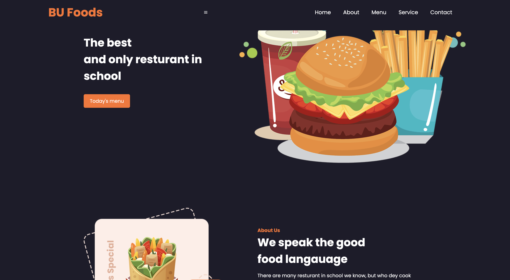

# 🍽️ BuRestaurant – Modern Restaurant Website

**BuRestaurant** is a responsive, visually engaging website built for a fictional restaurant brand. Designed to showcase menu offerings, promote the brand, and provide customers with a smooth browsing experience.

---

## ✨ Features

- 🏠 Beautiful homepage layout
- 🎨 Custom animations and transitions with CSS & JS
- 🔗 Smooth scrolling and navigation links

---

## 💻 Tech Stack

- HTML5
- CSS3
- JavaScript (Vanilla)

---

## 🖼 Preview




---

## 🚀 Live Demo

🌐 [Click to View Website on Vercel](https://buurestaurant-github-io-qwbm.vercel.app)


---

## 🛠 How to Run Locally

To view and test the project on your local machine:

1. **Clone the repository**
   ```bash
   git clone https://github.com/direxxi/burestaurant.github.io.git
